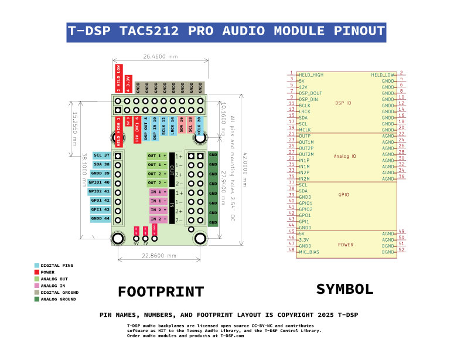

# T-DSP TAC5212 Pro Audio Module

**Part of the [T-DSP](https://t-dsp.com) open modular audio platform.**

A compact (50mm x 34.5mm) stereo audio codec module built around the **Texas Instruments TAC5212** high-performance audio ADC.

## About T-DSP

T-DSP is an open modular audio platform designed for musicians, engineers, and developers who want powerful digital signal processing in a flexible, hackable format. Built around a high-performance Teensy microcontroller and a high-quality codec, T-DSP combines studio-quality audio with a growing library of open-source modules for mixing, synthesis, effects, and more.

Whether you're building a custom digital mixer, crafting a unique instrument, or prototyping audio products, T-DSP gives you the tools to bring your ideas to life -- no proprietary systems, no licensing walls, just clean, creative freedom.

Join the community, contribute to the library, or grab a module and start patching. Learn more at [t-dsp.com](https://t-dsp.com).

## Overview

This codec module provides stereo ADC and DAC conversion and is one of the core building blocks of the T-DSP platform. It connects to backplanes and other modules via a 20-pin ribbon connector carrying digital audio, control, and power lines, allowing flexible system configurations.

## Audio Capabilities

### Inputs (2 stereo channels)
- Line-level (consumer -10dBV or professional +4dBu)
- Instrument-level (guitar/bass)
- Microphone (dynamic with up to 60dB internal gain)
- 100k ohm input impedance, DC-coupled
- Input voltage range: +/-5V max

### Outputs (2 stereo channels)
- Headphone drive (16-300 ohm, ~50mW @ 32 ohm)
- Consumer line out (-10dBV)
- Professional balanced output (+4dBu)
- 10 ohm output impedance, +/-3.3V output swing

## Digital Interface

- **I2S/PCM** audio data (DIN, DOUT, BCLK, LRCK, MCLK)
- **I2C** control bus for codec register configuration
- **GPIO** pins for additional control and sensing

## Modular Architecture

The board uses castellated edge pads (52 pins total) organized into functional groups:

- **DSP IO** (20 pins) -- digital audio (I2S), I2C control, MCLK, and power. Available as a 20-pin ribbon header for easy backplane connection via standard ribbon cable.
- **Analog IO** (16 pins) -- stereo input and output pairs with analog ground references.
- **GPIO** (8 pins) -- additional I2C, general-purpose IO, and digital ground.
- **Power** (8 pins) -- 5V, 3.3V, MIC_BIAS, and ground lines.

Because the digital signals are buffered on each module, system designers only need to focus on analog signal routing. The digital bus can be daisy-chained module-to-module using simple ribbon cables or board traces, works reliably over longer distances, and supports many modules on a single backplane.

## On-Board Circuitry

- LDO regulator for clean 3.3V analog power
- Buffered digital outputs for reliable backplane distribution
- TVS protection on audio outputs
- Ferrite bead RF filtering on audio inputs
- Solder jumpers for I2C address configuration
- Power indicator LED

## Project Files

| Directory | Contents |
|-----------|----------|
| `/3d_models/` | 3D models for PCB components and enclosure |
| `/documentation/` | TAC5212 datasheets and evaluation module docs |
| `/gerber/` | Manufacturing-ready Gerber output files |
| `/lib_fp/` | Custom KiCad footprint libraries |
| `/lib_sch/` | Custom KiCad schematic symbol libraries |
| `/panel/` | Panelized board layouts for production |

## License

This project is licensed under the [Creative Commons Attribution-NonCommercial-ShareAlike 4.0 International (CC BY-NC-SA 4.0)](https://creativecommons.org/licenses/by-nc-sa/4.0/).

You are free to share and adapt this work for non-commercial purposes, as long as you give appropriate credit and distribute any derivatives under the same license.
