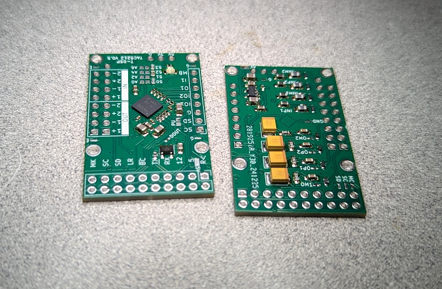
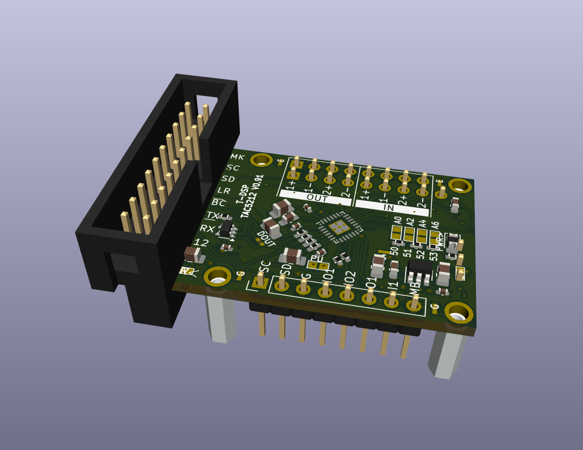
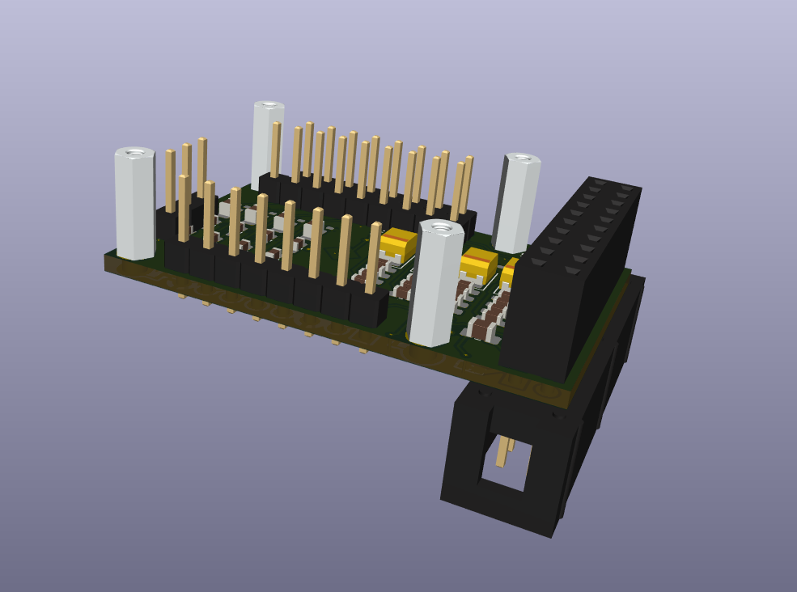
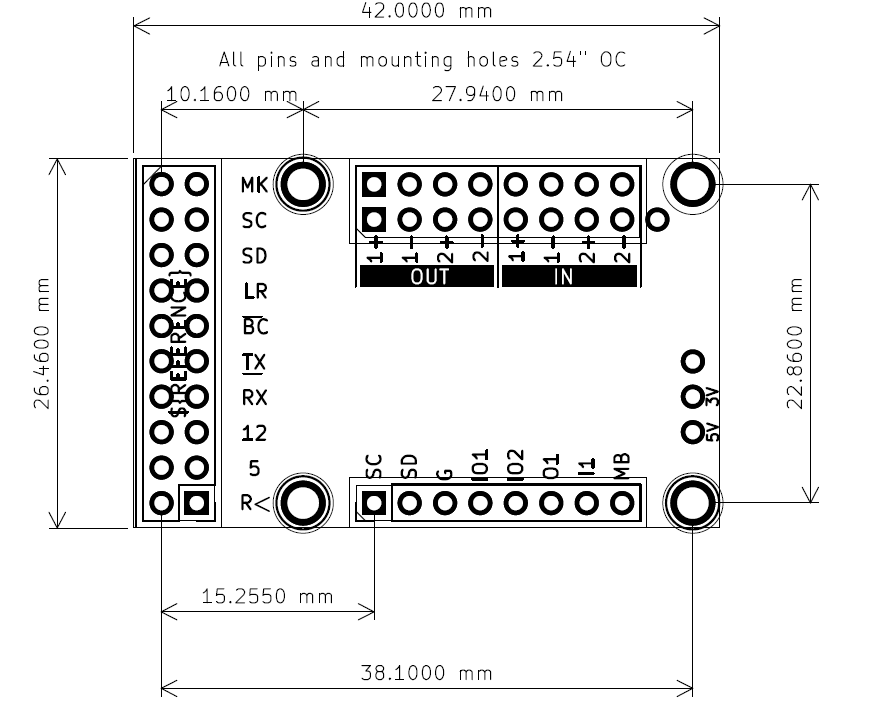
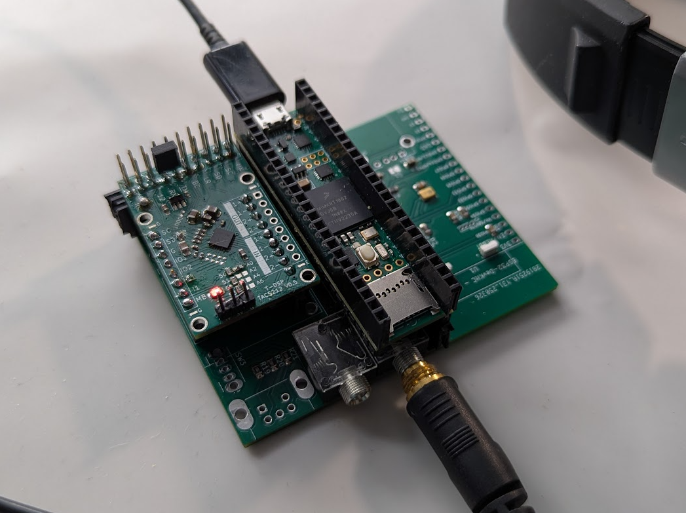
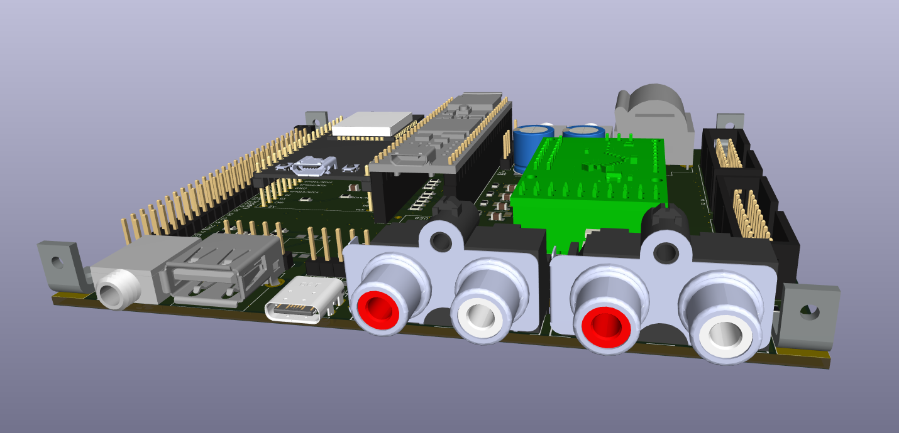
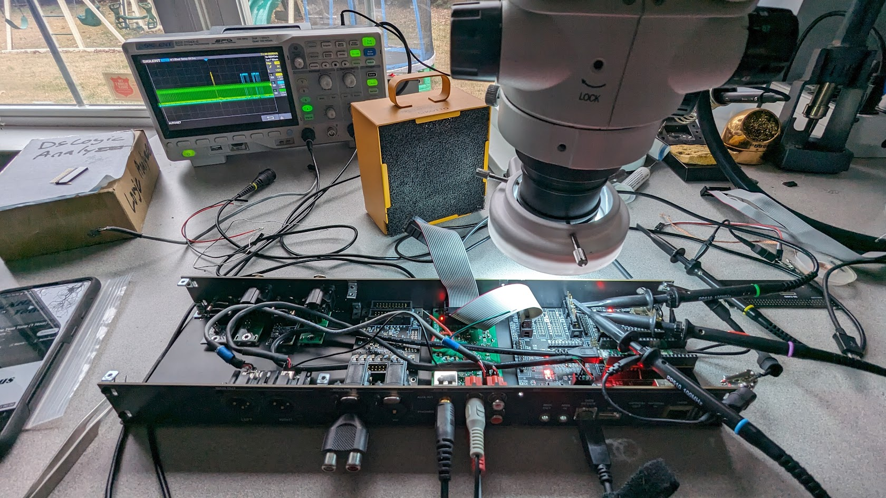

# T-DSP TAC5212 Pro Audio Module

**Part of the [T-DSP](https://t-dsp.com) open modular audio platform.**

A compact (50mm x 34.5mm) stereo audio codec module built around the **Texas Instruments TAC5212** high-performance audio codec.






## About T-DSP

T-DSP is an open modular audio platform designed for musicians, engineers, and developers who want powerful digital signal processing in a flexible, hackable format. Built around the [Teensy](https://www.pjrc.com/teensy/) microcontroller and the [Teensy Audio Library](https://www.pjrc.com/teensy/td_libs_Audio.html), T-DSP combines studio-quality audio with a growing library of open-source modules for mixing, synthesis, effects, and more.

Whether you're building a custom digital mixer, crafting a unique instrument, or prototyping audio products, T-DSP gives you the tools to bring your ideas to life.

Join the community, contribute to the library, or grab a module and start patching. Learn more at [t-dsp.com](https://t-dsp.com).

## Overview

This codec module provides stereo ADC and DAC conversion and is one of the core building blocks of the T-DSP platform. It is designed as a **chip-on-board module** -- a complete, self-contained audio codec that solders directly onto a user-designed backplane PCB, just like any other component. A KiCad footprint is provided so you can drop the module into your own backplane design, add whatever jacks and connectors your application needs, and build a custom audio device without dealing with codec layout or analog design.

## Audio Capabilities

### Inputs (2 differential pairs)
- Line-level (consumer -10dBV or professional +4dBu)
- Instrument-level (guitar/bass) with external preamp/buffer (preamp and buffer modules are on the T-DSP project roadmap)
- Microphone (dynamic, with up to 12dB analog channel gain and additional digital gain)
- Programmable input impedance (5k/10k/40k ohm), DC-coupled. Optional 100k ohm bias resistors on board.
- 2 VRMS full-scale differential input

### Outputs (2 differential pairs)
- Headphone drive (16-300 ohm, 62.5mW @ 16 ohm, ~31mW @ 32 ohm)
- Consumer line out (-10dBV)
- Professional balanced output (+4dBu)
- 10 ohm output impedance, 2 VRMS differential output

## Digital Interface

- **I2S/PCM** audio data (DIN, DOUT, BCLK, LRCK, MCLK)
- **I2C** control bus for codec register configuration
- **GPIO** pins for additional control and sensing

The T-DSP platform is developed with [Teensy](https://www.pjrc.com/teensy/) and the [Teensy Audio Library](https://www.pjrc.com/teensy/td_libs_Audio.html), but the module uses standard I2S and I2C interfaces and can work with any compatible microcontroller or DSP platform.

## Modular Architecture

The module connects to your backplane via **2.54mm (0.1") header pins** (52 pins total), organized into functional groups. Headers can be male/female for a removable connection, or soldered permanently with straight pins:

- **DSP IO** (20 pins) -- digital audio (I2S), I2C control, MCLK, and power. Also available as a 20-pin ribbon header for off-board connection via standard ribbon cable.
- **Analog IO** (16 pins) -- stereo input and output pairs with analog ground references.
- **GPIO** (8 pins) -- additional I2C, general-purpose IO, and digital ground.
- **Power** (8 pins) -- 5V, 3.3V, MIC_BIAS, and ground lines.


### Backplane Integration

A KiCad footprint for the module is included in `/lib_fp/`, allowing you to import it directly into your own backplane PCB design. You handle the jacks, connectors, and mechanical layout on your backplane -- the module takes care of codec, filtering, and power regulation.



**Example backplanes built with the T-DSP module:**






### Multi-Module Chaining

Because the digital outputs are buffered on each module, multiple modules can run together on the same digital bus. You can daisy-chain modules in two ways:

- **On the backplane** -- route the digital bus as board traces between multiple module footprints.
- **Via ribbon cable** -- use a ribbon cable with multiple taps to connect up to 4 modules per chain.

System designers only need to focus on analog signal routing. The buffered digital bus works reliably over longer distances and across many modules.

## On-Board Circuitry

- LDO regulator for clean 3.3V analog power
- Buffered digital outputs for reliable backplane distribution
- TVS protection on audio outputs
- Ferrite bead RF filtering on audio inputs
- Solder jumpers for I2C address configuration
- Power indicator LED

The T-DSP platform has gone through several design iterations. The bench prototype below is from an earlier version of the project -- a different module architecture that helped shape the current design.



## Project Files

| Directory | Contents |
|-----------|----------|
| `/3d_models/` | 3D models for PCB components and enclosure |
| `/documentation/` | TAC5212 datasheets, [schematic PDF](documentation/t-dsp-tac5212-schematic.pdf), [footprint drawing](documentation/t-dsp-tac5212-footprint.pdf), and [3D model (STL)](documentation/t-dsp_tac5212_pro_audio_module.stl). View online: [schematic](https://kicanvas.org/?github=https://github.com/t-dsp/t-dsp_tac5212_pro_audio_module/blob/main/t-dsp_tac5212_pro_audio_module.kicad_sch) and [PCB layout](https://kicanvas.org/?github=https://github.com/t-dsp/t-dsp_tac5212_pro_audio_module/blob/main/t-dsp_tac5212_pro_audio_module.kicad_pcb) via KiCanvas |
| `/lib_fp/` | Custom KiCad footprint libraries |
| `/lib_sch/` | Custom KiCad schematic symbol libraries |
| `/scripts/` | LCSC enrichment and BOM verification scripts |

## Building Manufacturing Files

Manufacturing files (gerbers, drill, BOMs, CPL, interactive BOM) are generated automatically by [KiBot](https://github.com/INTI-CMNB/KiBot) via GitHub Actions on every push to `main`. Download the ZIP from the **Actions** tab or from **Releases**.

The ZIP includes:
- Gerbers and drill files for any PCB fabricator
- JLCPCB BOM (`*_bom_JLCPCB.csv`) with LCSC part numbers
- Generic BOM (`*_bom_generic.csv`) with manufacturer part numbers
- Pick and place / CPL file
- Interactive BOM (also deployed live: [view iBOM](https://t-dsp.github.io/t-dsp_tac5212_pro_audio_module/ibom.html))

To build locally, install [Docker](https://www.docker.com/) and run:

```powershell
docker run --rm -v "${PWD}:/workspace" -w /workspace ghcr.io/inti-cmnb/kicad9_auto:latest kibot -c .kibot.yaml -b t-dsp_tac5212_pro_audio_module.kicad_pcb -e t-dsp_tac5212_pro_audio_module.kicad_sch -d manufacturing
```

Output files appear in `manufacturing/t-dsp_tac5212_pro_audio_module/`.

## Related Projects

Browse all T-DSP modules and backplanes on the [T-DSP GitHub organization](https://github.com/orgs/t-dsp/repositories).

## Status

This revision has not yet been built. The previous board was functional but had a few signal routing errors and needed a redesign of the analog output stage for low-impedance headphone drive. Those issues have been addressed in the current design.

If you build one, we'd love to hear how it goes -- please open an issue or reach out with your findings.

## Contact

For consulting, custom backplane design, or commercial licensing inquiries, reach out via [LinkedIn](https://linkedin.com/in/jayshoe).

## License

This project is licensed under the [Creative Commons Attribution-NonCommercial-ShareAlike 4.0 International (CC BY-NC-SA 4.0)](https://creativecommons.org/licenses/by-nc-sa/4.0/).

You are free to share and adapt this work for non-commercial purposes, as long as you give appropriate credit and distribute any derivatives under the same license.
